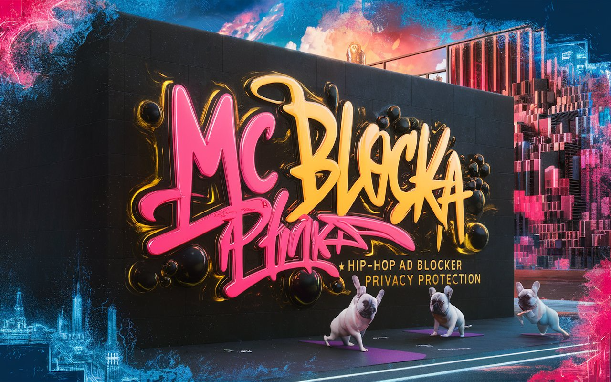

# mcblocka
A hip-hop infused ad blocker Chrome extension that blends privacy, control, and swagger

# MC BLOCKA - The Hiphop-Infused Ad Blocker

**MC BLOCKA** is not your average ad blocker. It’s a bold, customizable Chrome extension that brings you ad-free, secure browsing with hip-hop swagger. Packed with premium privacy protection, custom blocklists, real-time stats, and sound effects, MC BLOCKA makes your browser bounce to a new beat.

---

## Features

- **Ad-Free Browsing**  
  Blocks ads across all sites for faster, cleaner, distraction-free surfing.

- **Privacy and Security**  
  Say no to trackers, phishing attempts, and malware. Your data stays yours.

- **Custom Blocklists**  
  Want more control? Create your own rules to block or allow content your way.

- **Real-Time Stats**  
  See how many ads you’ve crushed — and feel good about it.

- **Badge System**  
  Earn achievements as you block.

- **Hip-Hop Theme and Sound Effects**  
  Browse with bold fuchsia-orange vibes, smooth dark mode, and beat-driven sound cues.

- **Premium Add-Ons**  
  Donate to unlock exclusive sounds, customization options, and next-level features.

---

## Installation

Get it from the Chrome Web Store:  
[MC BLOCKA Extension](https://chromewebstore.google.com/detail/mc-blocka/pojegfbfmnppjbmcpadhkagfdclbbipm?hl=en)

1. Click "Add to Chrome"  
2. Pin the extension to your toolbar  
3. Customize your settings and enjoy an elevated, ad-free web experience

---

## Why MC BLOCKA?

MC BLOCKA isn’t just about blocking ads — it’s about bringing personality to your privacy. Whether you’re coding, streaming, or deep-diving through tabs, this extension helps you stay focused, stay protected, and stay fresh.

---

## Support the Project

Love the vibe? Support the evolution of MC BLOCKA by donating to unlock premium features. Every contribution powers future drops and features.

---

## Tech Stack

- JavaScript (ES6+)
- Chrome Extension APIs (Manifest V3)
- HTML/CSS with dark mode styling
- WebAudio for sound cues
- Chrome Storage and LocalStorage APIs

---

## License

This project is open-source and licensed under the MIT License.

---

## The Dawgs Behind the Design

MC BLOCKA refers to its users as “dawgs”—a nod to hip-hop culture’s language of respect and solidarity. The bulldog avatars throughout the extension represent that community spirit. They're not just mascots; they're digital stand-ins for loyalty, focus, and presence in the online space.

---

MC BLOCKA... Because privacy deserves a soundtrack.

## Visual Preview

Here’s a look at MC BLOCKA’s visual identity and theming:

  
*Ad-free browsing with rhythm.*

  
*Your browser. Your temple. Your turf.*

